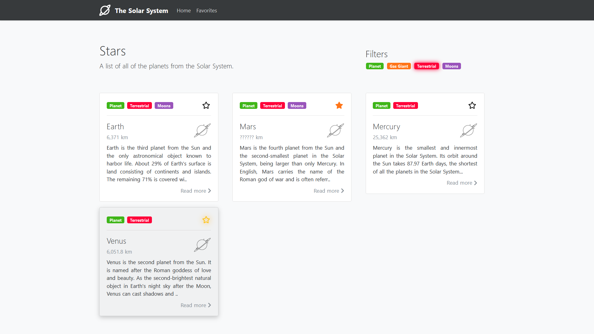
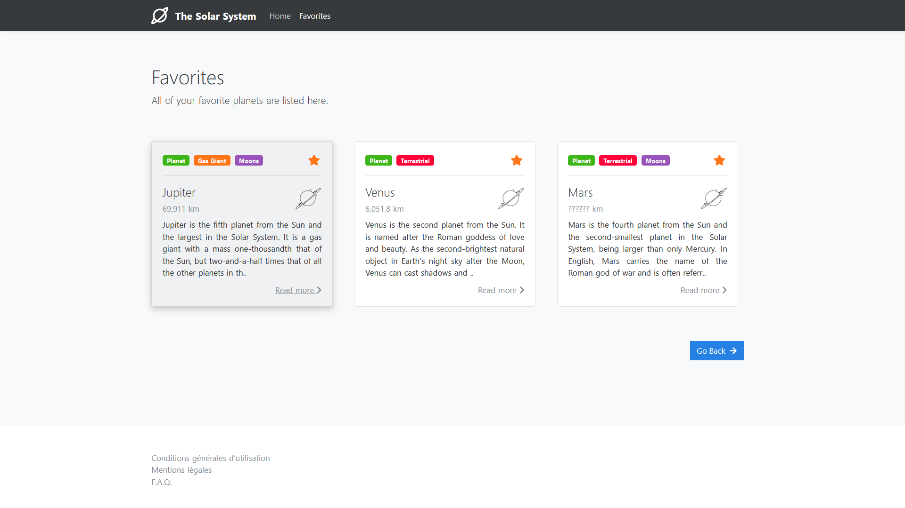
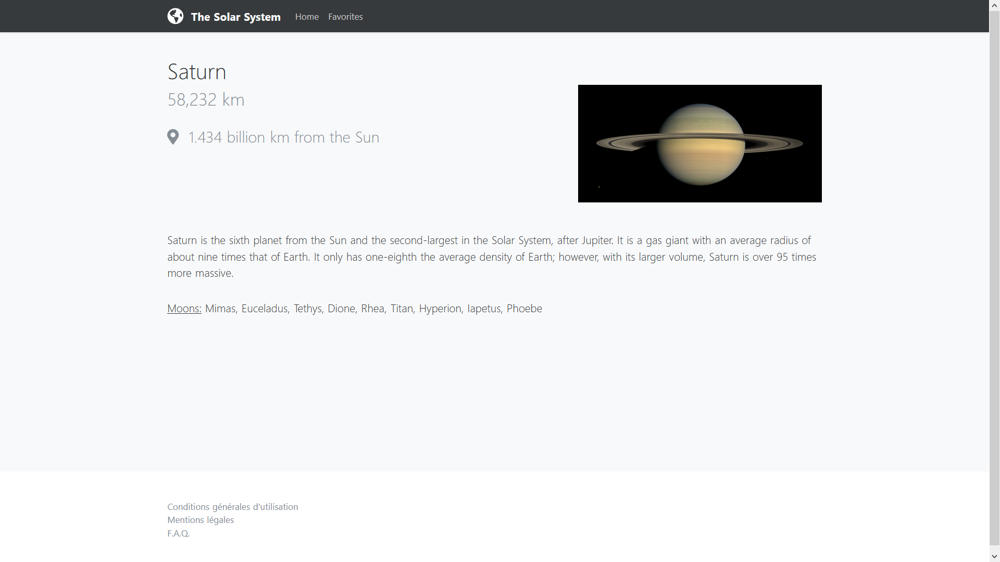

# Projet Astres NuxtJS
Projet de **NuxtJS** réalisé en cours de Framework JS à MyDigitalSchool

## Description

### Page des astres
Il s'agit de la page principal du site qui se charge d'afficher la liste de toutes les planètres du Système Solaire ayant été récupérées au préalable sur [l'API](#API). Sur cette page, il est possible d'ajouter/enlever un astre de ses favoris, filtrer l'affichage et accéder aux détails d'un astre en cliquant sur la carte correspondante.

### Page des favoris
Tous les astres qui ont été ajoutés aux favoris seront présent sur cette page. Un astre peut à tout moment être supprimé de cette liste si on le souhaite.

### Page du détail d'un astre
Après avoir sélectionné un astre dans la liste, on arrive sur cette page qui affiche tous les détails concernant celui-ci. Les données disponibles sont récupérées via le store.

Pour plus d'informations sur ce projet, vous pouvez également consulter le [cahier des charges du projet](static/projet.pdf).

## Accès en ligne

Une démo en ligne est disponible à l'adresse suivante : https://mds-projet-astres-nuxtjs.herokuapp.com/

## API

* [NuxtJS Planets](https://api.nuxtjs.dev/planets)

## Bibliothèques externes

* **JQuery**
* **Bootstrap**
* **Fontawesome**

## Licence

* **GNU General Public License v3.0** - Voir la [LICENSE](LICENSE) pour plus de détails.
