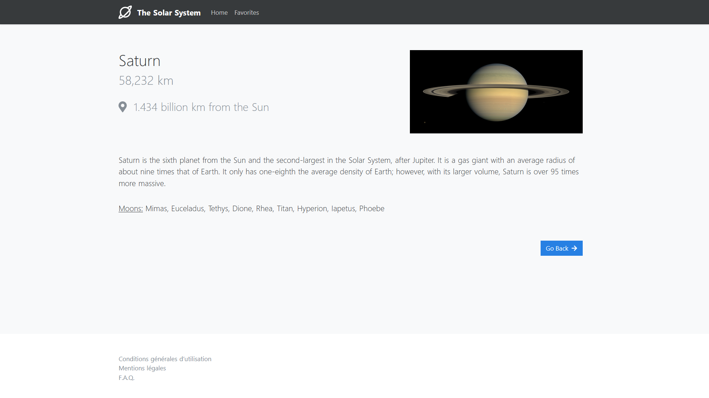

# Projet Astres NuxtJS

Projet **NuxtJS** réalisé en cours de Framework JS à MyDigitalSchool

## Présentation

### Page des astres
Il s'agit de la page principal du site qui se charge d'afficher la liste de toutes les planètes du Système Solaire.

Sur cette page, il est possible d'ajouter ou enlever un astre de ses favoris, filtrer l'affichage de la liste ou encore accéder aux informations d'un astre en cliquant sur la carte qui lui correspond.

### Page des favoris
Tous les astres qui ont été ajoutés aux favoris seront présent sur cette page.

Il est possible de retirer un astre de cette liste à tout moment. Pour cela, il suffit de cliquer sur l'icone en forme d'étoile présent sur la carte de l'astre que l'on souhaite supprimer.

### Page du détail d'un astre
Après avoir sélectionné un astre dans la liste, on arrive sur cette interface qui affiche tous les détails concernant celui-ci.

Toutes les informations qui sont affichées sur la page sont celles qui sont disponibles dans *le store* de l'application (qui contient toutes les données récupérées au préalable sur [l'API](#APIs)).

Pour plus d'informations sur ce projet, vous pouvez également consulter le [cahier des charges du projet](static/projet.pdf).

## Accès en ligne

Une démo en ligne est disponible ici : https://mds-projet-astres-nuxtjs.herokuapp.com/

## Tests

L'outil **Jest** nous permet de réaliser des tests au sein de notre application.

Il est donc possible de s'assurer du bon fonctionnement d'un composant grâce à la commande suivante : `npm run test`

* **Logo.spec.js** - Test par défaut fourni par Nuxt qui s'assure que le Logo soit accessible
* **StarList.spec.js** - Un simple test qui vérifie que le composant "StarList" contenant la liste des astres s'éxecute bien puis s'affiche correctement sur la [Page des astres](#Page-des-astres).

## APIs

* [NuxtJS Planets](https://api.nuxtjs.dev/planets)
* [Solar System OpenData](https://api.le-systeme-solaire.net/rest/bodies)

## Bibliothèques externes

* **JQuery**
* **Bootstrap**
* **Fontawesome**

## Licence

* **GNU General Public License v3.0** - Voir la [LICENSE](LICENSE) pour plus de détails.
